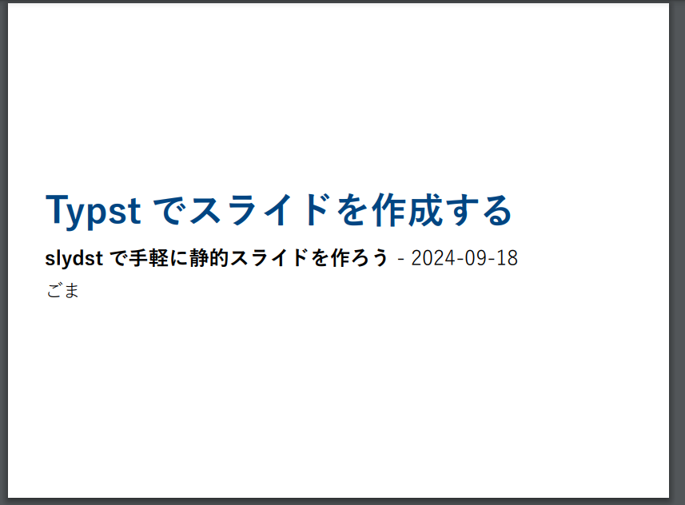
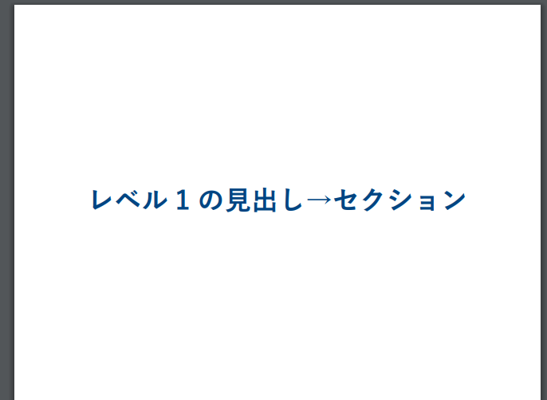
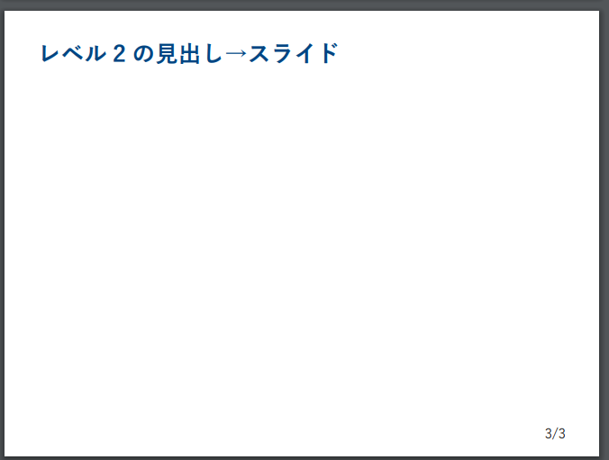
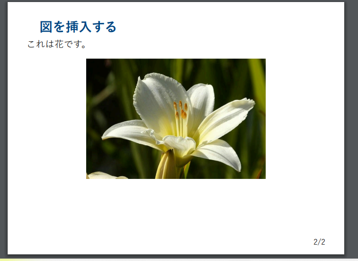
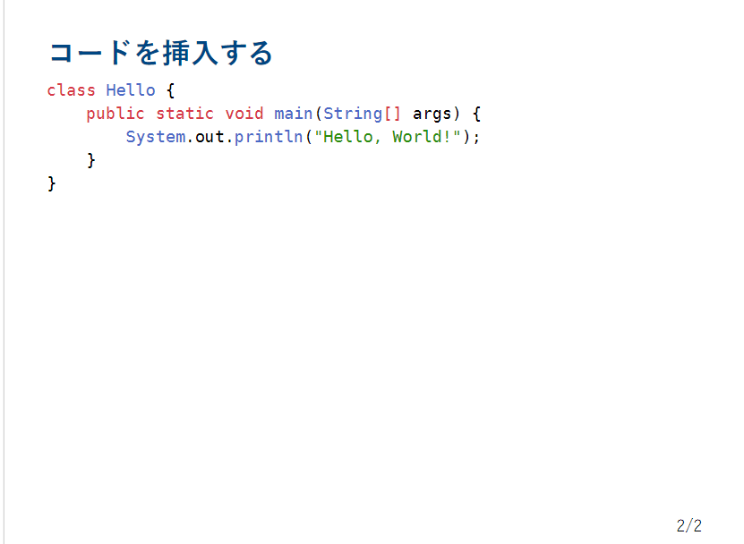
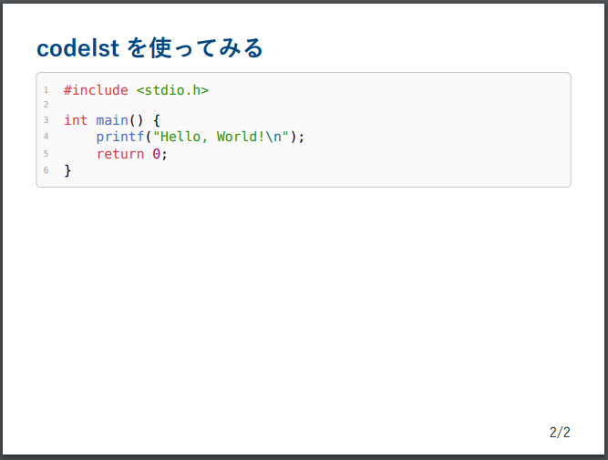
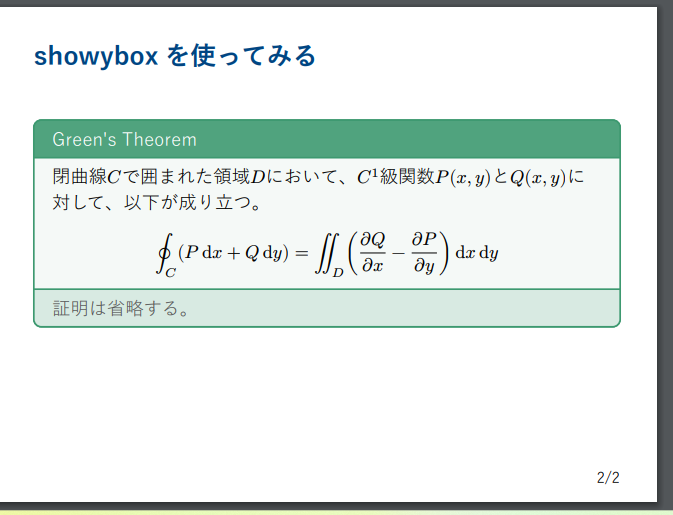

# はじめに
この記事では、Typstのパッケージであるslydstを使って、静的でシンプルなスライドを作成する方法について解説します。
このパッケージでは、Typstの見出しを利用してスライドのセクションやスライドを作成します。
公式のREADMEによると、アニメーション等はサポートされていないようですが、シンプルなスライドを作成するのには十分な機能が揃っているようです。

# 環境
2024年9月18日時点の最新版を使用しています。
- Typst: 0.11.1
- slydst:0.1.1

# 導入
パッケージの導入は、Typst Universeのページに存在する他のパッケージと同様に行えます。

```typst
#import "@preview/slydst:0.1.1": *
```

# 使い方
## タイトル等の設定
まず、Typstファイルを作成し次のようなプリアンブルを記述します。

```typst
#import "@preview/slydst:0.1.1": *

#show: slides.with(
  title: "ここにタイトルを挿入", // 必須
  subtitle: none,
  date: none,
  authors: (),
  layout: "medium",
  ratio: 4/3,
  title-color: none,
)

ここにコンテンツを挿入
```

このプリアンブルでは以下の項目を設定できます。
- title: スライドのタイトル
- subtitle: スライドのサブタイトル
- date: スライドの日付
- authors: スライドの著者
- layout: スライドのレイアウト
- ratio: スライドの幅と高さの比率
- title-color: タイトルの色

タイトルは必須ですが、他の項目は省略可能です。
それでは個人的に設定してみたものを以下に示します。

```typst
#set text(lang: "ja") // 言語を日本語に設定
#set text(font: ("Yu Gothic")) // フォントを設定

#set heading( numbering: "1.1.")

#import "@preview/slydst:0.1.1": *　// slydstの導入


#show: slides.with(
  title: "Typstでスライドを作成する ", // 必須
  subtitle: "slydstで手軽に静的スライドを作ろう",
  date: [#datetime.today().display()],
  authors: ("ごま"),
  layout: "medium",
  ratio: 4/3,
  title-color: none,
)

```



大体の設定の解説は必要なさそうですが、いくつか補足しておくと、`date`の項目は`#datetime.today().display()`で現在の日付を取得し、表示しています。詳しくは[datetime](https://typst.app/docs/reference/foundations/datetime/)を参照してください。また、`ratio`はスライドの幅と高さの比率を指定します。形式は`幅/高さ`なので、今回は`幅:4, 高さ:3`の比率に設定しています。`title-color`はタイトルの色を指定しますが、デフォルトの色が気に入っているので今回は指定していません。

## スライドの作成
次に、スライドの作成を行います。ここではTypstの見出しを利用してスライドのセクションやスライドを作成します。以下のように記述します。

```typst
= レベル1の見出し→セクション

== レベル2の見出し→スライド
```




このように、Typstの見出しを利用してスライドのセクションやスライドを作成することができます。スライドの内容は、見出しの下に記述します。

## 画像の挿入
画像を挿入する場合は、通常のTypstの画像挿入と同様に記述します。

```typst
==　図を挿入する
これは花です。
#figure(image("flower.jpg", width: 60%))
```



## コードの挿入
raw形式でコードを挿入することもできます。

```typst
    == コードを挿入する
    ```java
    class Hello {
        public static void main(String[] args) {
            System.out.println("Hello, World!");
        }
    }
    ```
```



# 他のパッケージとの併用
slydstを他のパッケージと併用してみます。これが可能であれば、LT会や講義等のための資料作成にかなり役立ちそうです。

## codelstでコードを挿入する
codelstパッケージはTypstでコードを挿入するためのパッケージです。以下のように記述します。詳しくは[私の記事](https://qiita.com/gomazarashi/items/ddef3d0db22a9f1e08ba)や[公式のマニュアル](https://github.com/jneug/typst-codelst/blob/main/manual.pdf)を確認していただくとして、今回は簡単な例を示します。
    
```typst
    == codelstを使ってみる
    #import "@preview/codelst:2.0.1":*
    #sourcecode[```c
        #include <stdio.h>

        int main() {
            printf("Hello, World!\n");
            return 0;
        }
    ```]
```



どうやら適切に挿入できているようです。もしサイズなどが気になる場合は`#figure`としてサイズを調整できそうですが、今回は割愛します。

## showyboxで装飾したboxを挿入する

showyboxパッケージはTypstで装飾したboxを挿入するためのパッケージです。こちらも申し訳ないですが、[私の記事](https://qiita.com/gomazarashi/items/2e83759fe6755b14b2bb)や[公式のマニュアル](https://github.com/Pablo-Gonzalez-Calderon/showybox-package/blob/main/Showybox's%20Manual.pdf)を参照してください。
それでは簡単な例を示します。

```typst
== showyboxを使ってみる
#v(10%)
#showybox(title: "Green's Theorem", frame: (
  border-color: olive,
  title-color: olive.lighten(10%),
  body-color: olive.lighten(95%),
  footer-color: olive.lighten(80%),
), footer: "証明は省略する。")[
  閉曲線$C$で囲まれた領域$D$において、$C^1$級関数$P(x,y)$と$Q(x,y)$に対して、以下が成り立つ。
  $ integral.cont_C (P dif x + Q dif y ) = integral.double_D ((diff Q)/(diff x)-(diff P)/(diff y)) dif x dif y $
]
```



数式も含め、適切に挿入できているようです。

# まとめ
今回はTypstのパッケージであるslydstを使って、静的でシンプルなスライドを作成する方法について解説し、他のパッケージとの併用も可能であることが確認できました。今回説明した以外のパッケージとも併用ができそうなので、機会があれば試してみたいと思います。

# 参考
- [slydst0.1.1](https://typst.app/universe/package/slydst)
- [glambrechts/slydst](https://github.com/glambrechts/slydst)
- [Typstでコードを埋め込むには【codelstパッケージ】](https://qiita.com/gomazarashi/items/ddef3d0db22a9f1e08ba) 
- [Typstで式やテキストを装飾する【showyboxパッケージ】](https://qiita.com/gomazarashi/items/2e83759fe6755b14b2bb)


